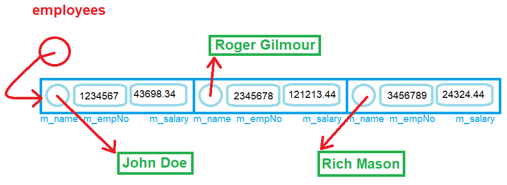

# Week #3, Exercise #1: Dynamic Memory

In this exercise, you will use *references* to modify content of variables in other scopes, overload functions and allocate memory at run-time and deallocate that memory when it is no longer required.


## Learning Outcomes

Upon successful completion of this exercise, you will have demonstrated the abilities to:

- allocate and deallocate dynamic memory for an array;
- overload functions;
- create and use references;


## Compiling and Testing Your Program

All your code should be compiled using this command on `matrix`:

```bash
g++ -Wall -std=c++11 -g -o ws file1.cpp file2.cpp ...
```

- `-Wall`: the compiler will report all warnings
- `-std=c++11`: the code will be compiled using the C++11 standard
- `-g`: the executable file will contain debugging symbols, allowing *valgrind* to create better reports
- `-o ws`: the compiled application will be named `ws`

After compiling and testing your code, run your program as follows to check for possible memory leaks (assuming your executable name is `ws`):

```bash
valgrind --show-error-list=yes --leak-check=full --show-leak-kinds=all --track-origins=yes ws
```

- `--show-error-list=yes`: show the list of detected errors
- `--leak-check=full`: check for all types of memory problems
- `--show-leak-kinds=all`: show all types of memory leaks identified (enabled by the previous flag)
- `--track-origins=yes`: tracks the origin of uninitialized values (`g++` must use `-g` flag for compilation, so the information displayed here is meaningful).

To check the output, use a program that can compare text files.  Search online for such a program for your platform, or use *diff* available on `matrix`.

> Note: All the code written must be implemented in the `seneca` namespace, unless instructed otherwise.


## Employees Salary Report

***Employees Salary Report*** is a program that reads an unknown number of `Employee` records from a file and stores them in a dynamically-allocated array. Each record holds the name, number, and salary of an employee in a comma-separated-values format (`csv` file).

The program is partially developed; you can find all the files in the repository. Your responsibility is to complete the code as stated in the comments in the source code.

Create a project and add to it the provided files. From the main menu in Visual Studio, select **`View` » `Task List`**; this will open a window with a list with all your tasks (the tasks are marked with `TODO` in the source code). You can click on each one of them and Visual Studio will take you to the place where you must insert code or make changes.

### The `Employee` Custom Type

The structure holding a record is designed as follows:

```cpp
/// <summary>
/// A structure that encapsulates some information about a
///   single employee.
/// 
/// The name of the employee is a dynamically-allocated array
///   of characters. It requires that the programmer manages
///   the memory (allocation and deallocation).
/// </summary>
struct Employee
{
    char* m_name;
    int m_empNo;
    double m_salary;
};
```

The name of the employee is held in a dynamically-allocated C-style string; an object of type `Employee` will store the address of this dynamically-allocated string. Consider the following visual and note that every circle with an arrow in this diagram shows dynamic memory in use. The green boxes represent dynamic memory.


  

### Data File

The data in the file has the following format:

```txt
EMPLOYEE NUMBER,SALARY,NAME<NEWLINE>
```

Two input files have been provided.  Test your code with those files.


### `File` Module (Partially Provided)

This module contains functions that facilitate working with files to read data. Look in the provided files and read the comments; make sure to understand the responsibilities of each function.  Read the provided code and make you understand how it accomplishes the goal.  If you need clarifications, contact your professor.


***Your Tasks:***

Implement 3 **overloads** of a function called `read`:

1. `read`: receives as parameter the **address** of an array of characters. Reads from the file the name of the employee and stores it in the parameter.

    Returns `true` if the read was successful, `false` otherwise.

    Use the following `fscanf` function to read the name of the employee from the file and return true if `fscanf` returns 1. See more information [here](https://en.cppreference.com/w/cpp/io/c/fscanf).

    ```C
    std::fscanf(g_fptr, "%[^\n]\n", ...);
    ```

2. `read`: receives as a parameter a **reference** to an integer representing the employee number. Reads from the file the employee number and stores it in the parameter.

    Returns `true` if the read was successful, `false` otherwise.

    Use the following `fscanf` function to read the number from the file and return true if `fscanf` returns 1. See more information [here](https://en.cppreference.com/w/cpp/io/c/fscanf).

    ```C
    std::fscanf(g_fptr, "%d,", ...);
    ```

3. `read`: receives as a parameter a **reference** to a floating-point number in double precision representing the employee's salary. Reads from the file the employee salary and stores it in the parameter.

    Returns `true` if the read was successful, `false` otherwise.

    Use the following `fscanf` function to read the salary from the file and return true if `fscanf` returns 1. See more information [here](https://en.cppreference.com/w/cpp/io/c/fscanf).

    ```C
    return std::fscanf(g_fptr, "%lf,", ...);
    ```


### `Employee` Module (Partially Provided)

This module contains functions and variables related to managing a collection of objects of type `Employee`.  Look in the provided files and read the comments; make sure to understand the responsibilities of each function.  Read the provided code and make you understand how it accomplishes the goal.  If you need clarifications, contact your professor.

***Your Tasks:***

Implement following functions:

- `load`: a function that receives as parameter a **reference** to an object of type `Employee`, loads from the file the information about the employee and returns `true` if it was successful (`false` otherwise).  Look in the provided files for the comments explaining in detail how to implement this function.

- `load`: an overload of the `load` function that receives as a parameter the **address** of C-string representing the file name with the data about employees.  Look in the provided files for the comments explaining in detail how to implement this function.

- `display`: a function that receives as a parameter an **unmodifiable reference** to an object of type `Employee` and prints it in the following format:

    ```txt
    NUMBER: NAME, SALARY<NEWLINE>
    ```

- `display`: an overload of the `display` function that receives an optional parameter of type `bool` (a parameter with a default value) and returns nothing. This function should:
  - print to screen

  ```txt
  Employee Salary Report
  no- Empno, Name, Salary
  -----------------------
  ```

  - if the parameter is `true`, sort the array by calling the `sort` function.
  - iterate over the array and print each employee in the format:

  ```txt
  IDX- EMPLOYEE_NUMBER: EMPLOYEE_NAME, EMPLOYEE_SALARY<NEWLINE>
  ```

  To print the name, salary, and number of an employee call the `display` function that accepts as a parameter a reference to an object of type `Employee`.

  - see sample output for more details.

- `deallocateMemory`: deallocate **all** the dynamic memory used by the collection of employees (make sure to also deallocate the names).  Look in the provided files for the comments explaining in detail how to implement this function.


### `tester_1` Module

This module is already provided. Look at it, make sure you understand it, but do not change it.


### Test Your Code

To test and demonstrate execution of your program use the same data as shown in the sample output.

Upload the header files (`*.h`), source code files (`*.cpp`), and the data files (`*.csv`) to your `matrix` account. Compile and run your code using the `g++` compiler as shown above and make sure that everything works properly.

Then, run the following command from your matrix account

```bash
~profname.proflastname/submit 200/week-X/ex-Y
```

- Replace `X` with week number: [`1` to `14`]
- Replace `Y` with the exercise number.

and follow the instructions.
